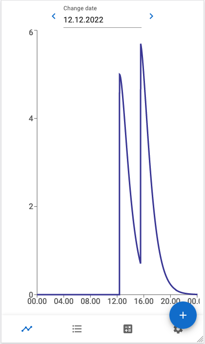
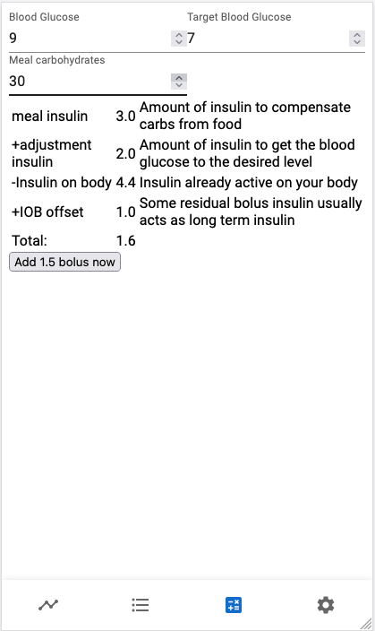

# IOB-calculator #

Simple app for calculating Insulin on Board.

## Assumptions ##

Insulin activity data function is the function from Fiasp calculated in this thread https://github.com/LoopKit/Loop/issues/388#issuecomment-313442742.

## Technology and security ##

Site is static and saves everything locally in the device.

## Disclaimer ##

Please use this just for demonstration purposes. This is not a medical software and should not be used in medical applications.

## Demo ##

Hosted on [https://iob.kalhama.fi/](https://iob.kalhama.fi/)

### IOB graph ###

### bolus calculator ###

## Known issues ##
1. Graph zoom doesn't work on mobile
3. useIOBCurve vois laskee mieluummin minuutin etukätee ku et säädetään aikaa millon insuliini laitetaan siellä ja täällä
4. there is slight jitter in graph when zooming in and out.
6. Cant scroll main page sometimes
8. there was bug in COB-plot at least once where plot jumped between 0 and actual balue

## Roadmap ##
1. BGPrediction refactoring
    - vähä harmittaa käyttää IOB ja COB, kun jos ennustusperiodin aikana jommassa kummassa on entry niin koko ennustus hyppää ihan pieleen
    - pitää miettii onks lineaarinen carb model oikeesti hyvä
    - olis cool ku bgpredictionis olis kolme käppyrää: insuliinille, carbeille ja yhteensä.
    - olis cool ku predictionin kellonajan voi valita. vois tarkastella esim ruokailun alkuajankohdasas ja todellisen BG kehitystä
2. Main pagen työstö
    - Innovaatiota Loopista?
    ...
3. Integrate BG from libre
    Network sync
        - hyvä puoli et voi droppaa localstoragen jollon datamigraatiot helpottuu
        ...
4. When performing calculations option to consider BG to be past (like 15 mins)
    ...
5. Data migrations
    - bolusReducer -> bolus
    - round all dates to 60 seconds
    - store data in redux in epoch
