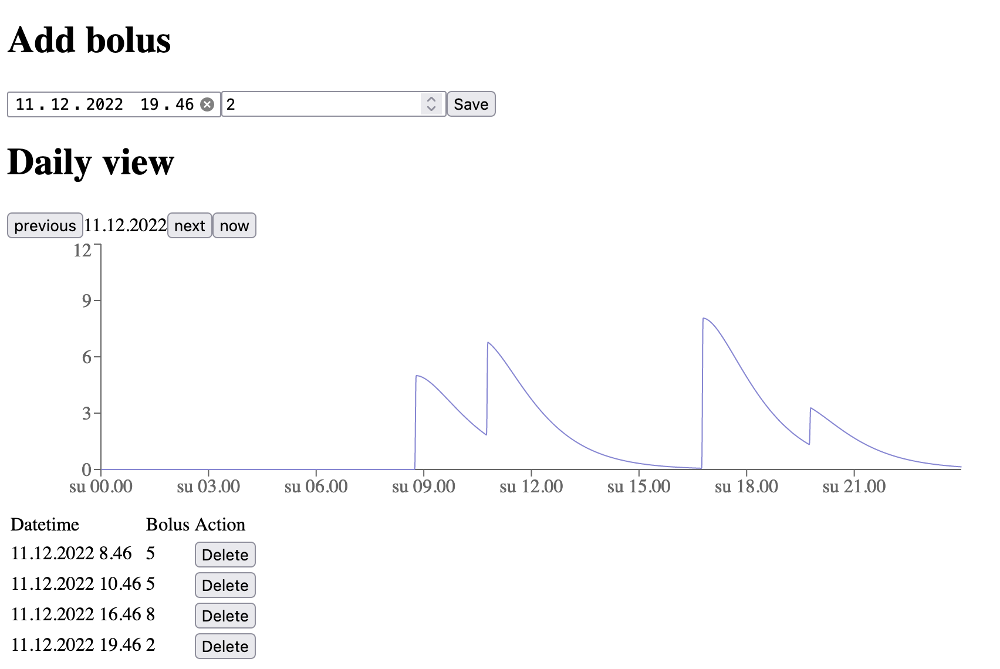

# IOB-calculator #

Simple app for calculating Insulin on Board.

## Assumptions ##

Insulin activity data function is the function from Fiasp calculated in this thread https://github.com/LoopKit/Loop/issues/388#issuecomment-313442742.

## Technology and security ##

Site is static and saves everything locally in the device.

## Disclaimer ##

Please use this just for demonstration purposes. This is not a medical software and should not be used in medical applications.

## Demo ##

Hosted on [https://iob.kalhama.fi/](https://iob.kalhama.fi/)

